# Authentication APIs 


### [Auth](#Auth)
- [Signup](#Signup)
  - [APIWorkflow](#APIWorkflow)
  - [Responses](#Responses)
- [Kcusers](#Kcusers)
- [Login](#Login)
  - [Login-Twophaseauth-Passcode-Validate](#Login-Twophaseauth-Passcode-Validate)
  - [Login-Twophaseauth-Passcode-Validate-Generate](#Login-Twophaseauth-Passcode-Validate-Generate)
- [Cleantables](#Cleantables)
- [Signdown](#Signdown)
- [Password](#Password)
  - [PasswordRecover](#Password-Recover)
  - [PasswordUpdate](#Password-Update)
- [Logout](#Logout)
- [Webhook](#Webhook)
  - [Identity-Webhook](#Identity-Webhook)
  - [Group-Subscription-Webhook](#Group-Subscription-Webhook)
  - [Group-Payout-Webhook](#Group-Payout-Webhook)
 


## Auth 


## Signup

- **Route & Decorators**

  ```@header_required```
    - A decorator that likely ensures authentication headers (like API keys or tokens) are present before 
      processing the request.
    - This Flask decorator ensures that requests have a valid header before processing.
    - Ensures that only authorized requests can proceed.
      
- **Retrieving Signup Parameters**
  
   ```
    username = getCleanRequestData('username')
    password = getCleanRequestData('password')
    firstname = getCleanRequestData('firstname')
    lastname = getCleanRequestData('lastname')
    contactno = getCleanRequestData('contactno')
  
   ```
    - This function  extracts request parameters safely, possibly sanitizing them.
    - It retrieves username, password, firstname, lastname, and contactno from the **request body**.
    - Retrieves a form **parameter from the request**.
    - Uses bleach.clean() to sanitize the input, preventing XSS attacks.
    -  Prevents malicious inputs from affecting the application.

-  **Checking if the User is an Admin**
   - This checks if the username exists in a predefined admin_profiles list.
   - If the username belongs to an admin, adminProfile is set to True.
 
- **Checking for Referral (if not Admin)**
    - If the user is not an admin, a **referredby** parameter is expected.
    - **validUsername(referredby)** ensures the referrer username is valid or else it returns Invalid referrer

-  **Validating Signup Fields**
     - **validateSignup(...)**:
        - Checks the syntax correctness of username, password, name, and contact number.
        - Used for preliminary input validation
        - Returns a list of invalid fields.
        - Validates user input fields for signup.
        - Ensures:
           - username is valid.
           - password is secure.
           - firstname, lastname, and contactno are present & valid.
        - Prevents invalid signups before storing data in the database
          
-  **Checking for Existing User**
     ```
           user = KittycashUser.query.filter_by(username=username).first()
            if user:
                message = "User " + username + " already exists"
                data = { 'message' : message }
                return jsonResponse(data, USER_PROFILE_ALREADY_EXISTS)
     ```

   
      - checks if the username already exists in the KittycashUser table.
      - If found returns User already exists
      - **KittycashUser**
          - Defines the database table for KittycashUser and stores user account details
          - Checks for duplicate users before creating a new one
          - Creates a new user entry
          - Manages user authentication & profile data.

 
-  **Checking if the Referrer Exists (if not Admin)**

   ```
   if not adminProfile:
    referredby_profile = KittycashProfile.query.filter_by(username=referredby).first()
    if not referredby_profile:
        data = { 'message' : "Referrer's profile does not exist at KittyCash platform!" }
        return jsonResponse(data, REFERRERS_PROFILE_DOESNOT_EXISTS)

   ```

    - If a referrer is provided, it verifies that the referrer’s profile exists in the KittycashProfile table.
 
    ```
         class KittycashProfile(UserMixin, db.Model):
        id = db.Column(db.Integer, primary_key=True)
        pid = db.Column(db.String(KC_PID_LEN), unique=True)
        username = db.Column(db.String(256), unique=True)
        address = db.Column(db.String(2000))
        city = db.Column(db.String(256))
        state = db.Column(db.String(256))
        postalcode = db.Column(db.String(64))
        firstname = db.Column(db.String(1000))
        lastname = db.Column(db.String(1000))
        alternateemail = db.Column(db.String(100))
        contactno = db.Column(db.String(128))
        age = db.Column(db.Integer)
        status = db.Column(db.Integer)
        credit = db.Column(db.Float) 
        country = db.Column(db.String(256))
        twophaseauth = db.Column(db.Integer)
        biometric = db.Column(db.Integer)
        deviceid = db.Column(db.String(512))
        osname = db.Column(db.String(128))
        stripestatus = db.Column(db.Integer)
        paypalstatus = db.Column(db.Integer)
        idnumber = db.Column(db.String(256))
        ssnlast4 = db.Column(db.Integer)
        identitystatus = db.Column(db.Integer)
        sid = db.Column(db.String(1024)) 
        identity = db.Column(db.String(512))

    ```

      - Defines the database table for user profiles.
      - Stores:
         - Personal information (firstname, lastname, contactno, address, age).
         - Security settings (twophaseauth, biometric).
         - Payment-related info (stripestatus, paypalstatus).
         -  User verification details (identitystatus, idnumber, ssnlast4).
       
        -  **Connection to /signup:**
          - Creates a new profile after user registration
          - Stores encryption keys
          - Handles user identity, authentication, and payment-related details.

    

- **Creating a New User**
  - Creates a new user in the KittycashUser table.
  - The password is hashed before storing.
 
- **Creating a Profile(Calls createProfile(...) to generate a profile for the user.)**

  ```
  profile = createProfile(username, '', firstname, lastname, '', contactno, '', 0)
  if not profile:
    data = { 'message' : "Failed to create profile due to internal error" }
    return jsonResponse(data, USER_SIGNUP_FAILURE)

  ```

  - **createProfile** Function
     ```
               def createProfile(username, address, firstname, lastname, altemail, contactno, country, age):
            currentDateTime = datetime.now()
            pid = createProfileId()
            new_profile = KittycashProfile(username=username, pid=pid, address=address, firstname=firstname,
                                  lastname=lastname, alternateemail=altemail, contactno=contactno, age=age, 
                                  credit=0.0,
                                  activeFrom=currentDateTime, profilePhoto=USER_PROFILE_PHOTO, 
                                  status=ProfileStatus.ACTIVE.value,
                                  country=country, stripestatus=ProfileStripeStatus.PASSIVE.value, 
                                  paypalstatus=ProfilePaypalStatus.PASSIVE.value,
                                  identitystatus=ProfileIdentityStatus.PASSIVE.value, twophaseauth=1) 
            db.session.add(new_profile)
            db.session.commit()
            
            success = createProfileTables(pid, True)
            if not success:
                # Cleanup all objects associated with profile
                db.session.delete(new_profile)
                db.session.commit()
                logging.info("Failed to create profile related tables")
                return None
        
            return new_profile
     ```

    - Creates a new profile in the KittycashProfile table.
    - Generates a unique profile ID (pid) using createProfileId().
    - Initializes:
       - User details (username, firstname, lastname, contactno).
       - Financial details (credit, stripestatus, paypalstatus).
       - Security settings (twophaseauth = 1).
       - Commits the new profile to the database.
       - Calls createProfileTables(pid, True) to create database tables for the user.
       - If table creation fails, it deletes the profile to avoid orphaned entries.

    **Connection to /signup**
       - Called inside /signup to register a user’s profile,If createProfile fails, signup is aborted with
       - Ensures a new user profile is fully set up before finalizing signup.


- **Validating Public & Private Keys**

 ```
   publicKey = json.loads(request.form.get('publickey'))
if not validatePublicKey(publicKey['kty'], publicKey['crv'], publicKey['x'], publicKey['y']):

 ```

  - Parses and validates the public key and public key


 ```
   privateKey = json.loads(request.form.get('privatekey'))
if not validatePrivateKey(privateKey['kty'], privateKey['crv'], privateKey['x'], privateKey['y'], privateKey['d']):

 ```

   - Called inside /signup to validate encryption keys
   - Prevents users from providing invalid security keys.


- **Storing Profile Keys (Encrypts public/private keys and stores them in KittycashProfileKey.)**

  ```
    encryptionKey = getEncryptionKey()
    profileKey = KittycashProfileKey(pid=profile.pid, publickey=json.dumps(publicKey),   
    privatekey=json.dumps(privateKey), encryptionKey=encryptionKey)
    db.session.add(profileKey)
    db.session.commit()

  ```
   - **getEncryptionKey** Function generates a random encryption key using the Fernet cryptography module.
   - The key is base64-encoded and returned as a string.
   - Called inside /signup to generate an encryption key before storing user profile keys
   - Ensures users' private data is securely encrypted.
 
  ```
    class KittycashProfileKey(UserMixin, db.Model):
    id = db.Column(db.Integer, primary_key=True)
    pid = db.Column(db.String(KC_PID_LEN), db.ForeignKey('kittycash_profile.pid'))
    publickey = db.Column(db.String(1024))
    privatekey = db.Column(db.String(1024))
    encryptionKey = db.Column(db.String(1024))

  ```
    - Defines a database model to store:
       - pid → The profile ID it belongs to.
       - publickey → The user’s public key.
       - privatekey → The user’s private key.
       - encryptionKey → The randomly generated encryption key.
    - Connection to /signup:
       - Stores the user’s keys after validation
       - Ensures secure storage of user encryption keys.


- **Preparing User Data for Stripe & Referrals**

 ```
 data = {
    'firstname' : profile.firstname,
    'lastname' : profile.lastname,
    'username' : profile.username,
    'contactno' : profile.contactno,
    'pid' : profile.pid,
}

 ```

  - Creates a dictionary of user details (first name, last name, username, contact number, profile ID).
  - This data will be used later for Stripe integration and referral tracking


- **Sending Data for Stripe Customer Creation**

   ```
    msg = list(data.values())
    label = "create_" + profile.pid + "_customer"
    create_stripe_customer.submit_stored(label, profile.pid, profile.firstname + " " + profile.lastname, 
    profile.username)
 
   ```

  **create_stripe_customer Function**
  
    
           @executor.job
           def create_stripe_customer(pid, name, email, retryCount=0):
                try:
                    retry = createStripeCustomer(pid, name, email)
                    if retry:
                        if retryCount == MAX_RETRIES:
                            logging.info("Reached max retries - defer stripe customer creation for %s", pid)
                            return
                        exponential_backoff_jitter(retryCount+1, base_delay=1, max_delay=10)
                        logging.info("retry creating the stripe account for pid %s for %d time", pid, retryCount+1)
                        create_stripe_customer.submit(pid, pid, name, email, retryCount+1)
                except:
                    logging.info("Failed to create stripe customer for profile with pid %s ", pid)
 
    

  - Creates a Stripe customer account for payments.
  - If the request fails, it:
     - Retries with an exponential backoff delay.
     - Stops retrying after MAX_RETRIES.
     - Connection to /signup
     - Called inside /signup after creating a profile
     - Prepares the user for future Stripe payments


  - Converts data values into a list (to be used in logging or debugging).
  - Generates a unique label for the Stripe customer request.
  - Calls create_stripe_customer.submit_stored(...) to create a Stripe customer using:
     - Profile ID (profile.pid)
     - Full name (profile.firstname + " " + profile.lastname)
     - Username (used as Stripe’s customer email).
  - ✅ Purpose: Helps handle future subscriptions/payments for the user.

-  **Referral Handling (if not Admin)**
   - Checks if this user was invited by someone (referredby).
   - Looks in KittycashProfileInvitees to see if this invite already exists.
 
     ```
      class KittycashProfileInvitees(UserMixin, db.Model):
      id = db.Column(db.Integer, primary_key=True)
      email = db.Column(db.String(KC_USERNAME_LEN)),
      invitedByEmail = db.Column(db.String(KC_USERNAME_LEN))

     ```
      - Stores referral invitations in the database.
      - email → Invitee’s email
      - invitedByEmail → The referring user's email.
      - Checks if the user was invited by someone
      -  Tracks user referrals.
 
     ```
       if invite_exists:
      invitee_table_name = "kcpi_"+ referredby_profile.pid
      profile_invitee_table = getTable(invitee_table_name)
      update_query = profile_invitee_table.update().where(profile_invitee_table.c.email == 
      profile.username).values(status=ProfileReferralStatus.REGISTERED.value)
      db.session.execute(update_query)
     
     ```

      - If the invite exists, updates the referrer’s invite table (kcpi_<referrer_pid>).
      - Marks the invitee (profile.username) as REGISTERED.
      - ✅ Purpose: Ensures referral tracking is updated correctly.

       ```
         def getTable(table_name):
        with application.app_context():
            db.metadata.bind = db.engine
            db.metadata.reflect()
            return db.metadata.tables[table_name]

        ```
      - Retrieves a table dynamically from the database.
      - Uses db.metadata.reflect() to load table metadata dynamically.
      - Returns the requested table object from db.metadata.tables.
      - Connection to /signup:
         - Used in referral tracking & direct messaging
         - Allows dynamic interaction with the database tables.


- **Creating a Direct Message Group (DM)**

  ```
     dmid = ''
     dmGroup_response = createDirectMessageGroupInternal(referredby_profile.pid, [profile.pid])
     if dmGroup_response.status == '200 OK':
      dmGroupDict = json.loads(str(dmGroup_response.data, 'utf-8'))
      dmid = dmGroupDict['dmid']

  ```

   - Creates a direct message (DM) group between the referrer (referredby_profile.pid) and the newly signed-up user (profile.pid).
   - Extracts the dmid (Direct Message ID) from the response.
   - ✅ Purpose: Enables referrer-invitee messaging.

 **createDirectMessageGroupInternal Function**

  ```
        def createDirectMessageGroupInternal(pid, membersbypid=None):
        profile = KittycashProfile.query.filter_by(pid=pid).first()
        name = profile.firstname + " " + profile.lastname
        pids = []
        skipAddPids = False
        keys = None
    
        if membersbypid == None:
            membersbypid = json.loads(getCleanRequestData("pids"))
        else:
            keys = generateGroupKeys()
    
        # Find if there exists a direct message group with these participants
        lookupList = [memberpid for memberpid in membersbypid]
        lookupList.append(pid)
        dmGroup = getDirectMessageGroupWithParticipants(pid, lookupList)
        
        if not dmGroup:
            dmGroup, message = createNewDirectMessageGroup(pid, keys)
            if not dmGroup:
                return jsonResponse({ 'message' : message }, EXCESS_GROUPS_PER_USER)
        else:
            skipAddPids = True

   
  ```

  - Creates a direct message (DM) group for a user.
  - If a group with the same participants already exists, it uses that group instead of creating a new one.
  - If no group exists, it calls: ```dmGroup, message = createNewDirectMessageGroup(pid, keys)```
  - Adds participants and assigns public keys.
  - Connection to /signup
     - Used to set up a direct message group for referral-based signups:
        ```dmGroup_response = createDirectMessageGroupInternal(referredby_profile.pid, [profile.pid])```
     - Handles referral-based messaging setup between the referrer and the new user.
   
  **getDirectMessageGroupWithParticipants Function**

  ```
     def getDirectMessageGroupWithParticipants(pid, memberPids):
      if not tableExists(db, KC_PROFILE_DMGROUPS_TABLE_PREFIX + pid):
          return None
      
      dmGroups = db.engine.execute("SELECT * FROM " + KC_PROFILE_DMGROUPS_TABLE_PREFIX + pid).fetchall()
      memberPids = removeDuplicates(memberPids)
  
      for dmGroup in dmGroups:
          listParticipantsQuery = "SELECT * FROM " + KC_PROFILE_DIRECT_TABLE_PREFIX + dmGroup.dmid
          participants = db.engine.execute(listParticipantsQuery).fetchall()
          existingPids = [participant.pid for participant in participants]
          
          if len(memberPids) != len(existingPids):
              continue
  
          if len(existingPids) == 1 and ((pid in existingPids) or (existingPids[0] in memberPids)):
              return KittycashDirectMessageGroup.query.filter_by(dmid=dmGroup.dmid).first()
          
          membersFound = sum(1 for existingPid in existingPids if existingPid in memberPids)
  
          if len(existingPids) == membersFound:
              return KittycashDirectMessageGroup.query.filter_by(dmid=dmGroup.dmid).first()
  
      return None

  ```
  - Checks if a direct message group already exists between a user (pid) and a set of participants.
  - Queries the user’s DM groups and compares participants.
  - If a matching group exists, return that group ID (dmid).
  - Connection to /signup:
     - Used in createDirectMessageGroupInternal() to prevent duplicate DM groups.
     -  Ensures users don’t get multiple DM groups for the same people.
   
    
**createNewDirectMessageGroup Function**

 ```
     def createNewDirectMessageGroup(pid, keys=None):
      dmid = createDirectMessageGroupId()
      dmGroup = KittycashDirectMessageGroup(dmid=dmid, creatorpid=pid, status=GroupStatus.ACTIVE.value, 
      activeFrom=datetime.now())
      db.session.add(dmGroup)
      dmGroupKey = addDirectMessageGroupKeys(dmGroup.dmid, keys)
      db.session.commit()

 ```
  - Creates a brand-new direct message group.
  - Assigns a unique group ID (dmid).
  - Calls addDirectMessageGroupKeys() to store encryption keys.
  - Stores the group in the database.
  - Connection to /signup:
    - Used when a new user is invited and needs a referral-based DM group.
    - ✅ Ensures all users have secure, organized group messaging.
   

**addDirectMessageGroupProfileInternal Function**

 ```
    def addDirectMessageGroupProfileInternal(pid, dmid, pidOfUser):
    profile = KittycashProfile.query.filter_by(pid=pidOfUser).first()
    if not profile:
        return jsonResponse({ 'message' : 'User profile not found' }, USER_PROFILE_DOESNOT_EXISTS)
    
    dmGroup = KittycashDirectMessageGroup.query.filter_by(dmid=dmid).first()
    if not dmGroup:
        return jsonResponse({"message": "Invalid Direct Message Group"}, INVALID_GROUP)

    participantQuery = "SELECT * FROM " + KC_PROFILE_DIRECT_TABLE_PREFIX + dmid + " WHERE pid='"+pid+"'"
    participant = db.engine.execute(participantQuery).fetchone()

    if not participant:
        return jsonResponse({"message": "Unauthorized user access on group"}, UNAUTHORIZED_GROUP_ACCESS)


 ```
  - Adds a user to a direct message group.
  - Checks if:
     - The user profile exists.
     - The DM group is valid.
     - The user has permission to add new members.
  - Connection to /signup:
    - Used when the new user joins a referral-based group.
    - ✅ Ensures users can only join valid groups where they are authorized.   
    
**getUserProfilePhotoPath Function**

 ```
    def getUserProfilePhotoPath(profilePhoto):
    if S3ENABLED:
        if profilePhoto == USER_PROFILE_PHOTO:
            return os.path.join(PROFILE_PHOTOS_NETWORK, 'profile.png')
        else:
            profile_photo_url = getProfileS3Bucket().getObjectUrl(profilePhoto)
            if not profile_photo_url:
                return os.path.join(PROFILE_PHOTOS_NETWORK, 'profile.png')
        return profile_photo_url
    if not os.path.exists(os.path.join(PROFILE_PHOTOS_FOLDER, profilePhoto)):
        return os.path.join(PROFILE_PHOTOS_NETWORK, 'profile.png')
    return os.path.join(PROFILE_PHOTOS_NETWORK, profilePhoto)


 ```

- Retrieves a user’s profile picture.
- If S3 (Amazon Cloud Storage) is enabled, fetch the profile image from S3.
- If the file doesn’t exist locally, return a default profile picture.
- Connection to /signup:
   - Used when returning user details in the signup response.
   - ✅ Ensures every user has a profile picture, even if they haven’t uploaded one.
    
    

- **Updating Referrer’s Contact List**

    ```
   contact_table_name = "kcpc_"+ referredby_profile.pid
    profile_contact_table = getTable(contact_table_name)
    update_query = profile_contact_table.update().where(profile_contact_table.c.email == 
    profile.username).values(status=ProfileReferralStatus.REGISTERED.value, contactpid=profile.pid, dmid=dmid)
    db.session.execute(update_query)
    db.session.commit()
   
    ```

     - Updates the referrer’s contact table (kcpc_<referrer_pid>) to:
     - Mark the invitee as REGISTERED.
     - Associate the invitee’s pid.
     - Link the direct message group (dmid).
     - ✅ Purpose: Keeps referral data & messaging system in sync.

- **Sending Email Notification to the Referrer(If not the adminProfile)**

    ```
       if not adminProfile:
        contents = ['Congratulations, referred user with ' + profile.username + '\nregistered successfully at 
        KittyCash platform!']
        subject = 'KittyCash - Referred user registered at KittyCash'
        emailUser.submit(referredby_profile.username, subject, contents)

    ```

     - Sends an email notification to the referrer about the successful signup of their invitee.
     - ✅ Purpose: Keeps the referrer informed.

- **Sending Email & SMS Notification to the New User**

   ```
    contents = ['User created successfully, Please verify with login']
    subject = 'KittyCash - User Signup Successful'
    emailUser.submit(username, subject, contents)
    message = "KittyCash - User created successfully! Please check your email"
    smsUser.submit(contactno, message)
   
    ```

     - Sends a signup success email to the new user (username).
     - Sends a confirmation SMS to the user’s phone (contactno).
     - ✅ Purpose: Confirms signup & prompts login verification.

- **Setting Up Subscription & Pricing Details**

   ```
    price = {}
    price['yearly'] = PROFILE_YEARLY_SUBSCRIPTION_RATE
    price['monthly'] = PROFILE_MONTHLY_SUBSCRIPTION_RATE

   ```

    - Defines yearly & monthly subscription prices.
 
  ```
    subscription_dict = {}
    subscription_dict['stripecid'] = ''
    subscription_dict['subscriptionstatus'] = False
    subscription_dict['subscriptiontype'] = ProfileSubscriptionType.YEARLY.value
    subscription_dict['priceid'] = ''
    subscription_dict['methodid'] = ''
    subscription_dict['sid'] = ''
    now = datetime.datetime.now().strftime("%Y-%m-%d %H:%M:%S")
    subscription_dict['activeFrom'] = now
    subscription_dict['expiryDate'] = now
    subscription_dict['pid'] = profile.pid

  ```

   - Initializes subscription details with default values (inactive).
   - Purpose: Prepares the user for future subscription management.


- **Assigning User Role**

  ```
    userRole = KittyCashUserRole.REGULAR.value
    if profile.username in admin_profiles:
      userRole = KittyCashUserRole.ADMIN.value
  
  ```
  - Determines if the user is an ADMIN or REGULAR user.
  - Purpose: Ensures correct role-based access control (RBAC).

- **Final API Response**


   ```
       data = { 
          'pid' : profile.pid,
          'username' : profile.username,
          'name' : name,
          'firstname': profile.firstname,
          'lastname' : profile.lastname,
          'phone' : profile.contactno,
          'altemail' : profile.alternateemail,
          'address': profile.address,
          'age' : str(profile.age),
          'credit' : profile.credit,
          'publickey': profileKey.publickey,
          'privatekey': profileKey.privatekey,
          'twophaseauth' : profile.twophaseauth,
          'identitystatus' : profile.identitystatus,
          'usersubscription' : subscription_dict,
          'prevactiveusersubscription' : subscription_dict,
          'role': userRole,
          'subscription' : price,
          'message' : 'User profile created successfully, Please check your email!'
      }
      return jsonResponse(data, HTTP_SUCCESS)
       
   ```

  - Constructs the final JSON response with:
  - User details (pid, username, name, phone, etc.).
  - Subscription details (pricing, active/inactive).
  - Security keys (public/private keys).
  - User role.
  - Success message.


### APIWorkflow
 
1. Receive input parameters from the request body.  
2. Validate fields:  
   - Check syntax.  
   - Ensure no missing or invalid data.  
3. Check if the username already exists in the database. (Checking if the User is an Admin)
4. If the User is an admin validate whether his email exists in the database in **KittycashUser** or not
5.  If a referral exists(If not admin), verify that the referrer is a valid user in **KittycashProfile** 
6. Create a new user account:  
   - Store hashed password securely.  
7. Create the user profile:  
   - Store basic details in **KittycashProfile**.  
8. Validate and store encryption keys in **KittycashProfileKey**:  
   - Save public and private keys securely.  
9. Register the user in **Stripe**  in **KittycashStripeCustomers** for future subscriptions and payments.  
10. Handle referral logic (if not admin):
   - Checks if this user was invited by someone (referred by).
   - Look in KittycashProfileInvitees to see if this invite already exists.
   - Link the invitee to the referrer by creating a direct message group. 
   - Update the referrer’s records.  
     
11. Send confirmation notifications:  
    - Emails & SMS to both the user and the referrer.
12. Assign User Role
13. Return user profile details:  
    - Role, subscription, security keys, etc.

```
mermaid
sequenceDiagram
    participant Client as KittyCashUser (Client)
    participant API as Flask API
    participant DB as Database (KittyCashUser, KittyCashProfile, KittycashProfileKey, KittycashStripeCustomers, KittycashProfileInvitees)
    participant Stripe as Stripe API
    participant Email as Email Service
    participant SMS as SMS Gateway

    Client->>API: POST /signup (username, password, firstname, lastname, contactno, publickey, privatekey, referredby)
    
    API->>API: Validate Input Fields (Syntax, Missing Data)
    alt Invalid Fields
        API-->>Client: 400 Bad Request ("Invalid or Missing Parameters") ❌
    end
    
    API->>DB: Check if Username Exists in KittyCashUser
    alt Username Exists
        API-->>Client: 409 Conflict ("User Already Exists") ❌
    end
    
    API->>DB: Check if User is an Admin
    alt Admin User
        API->>DB: Verify Admin Email in KittyCashUser
        alt Admin Email Not Found
            API-->>Client: 403 Forbidden ("Admin Access Denied") ❌
        end
    else Non-Admin User
        API->>DB: Verify Referrer Exists in KittyCashProfile
        alt Referrer Not Found
            API-->>Client: 404 Not Found ("Referrer Does Not Exist") ❌
        end
    end

    API->>DB: Create New User in KittyCashUser (Store Hashed Password)
    API->>DB: Create Profile in KittyCashProfile (Store Basic Details)
    
    API->>API: Validate Public & Private Keys
    alt Invalid Encryption Keys
        API-->>Client: 400 Bad Request ("Invalid Encryption Keys") ❌
    end
    
    API->>DB: Store Encryption Keys in KittycashProfileKey
    
    API->>Stripe: Register User in Stripe for Payments
    Stripe-->>API: Return Stripe Customer ID
    API->>DB: Store Stripe Customer ID in KittycashStripeCustomers
    
    alt User Was Referred
        API->>DB: Check Referral Exists in KittycashProfileInvitees
        alt Referral Exists
            API->>DB: Link Invitee to Referrer (Create DM Group)
            API->>DB: Update Referrer’s Records
        else No Referral Found
            API-->>Client: 404 Not Found ("Referral Not Found") ❌
        end
    end
    
    API->>Email: Send Confirmation Email to User
    API->>SMS: Send SMS Confirmation to User
    alt User Was Referred
        API->>Email: Notify Referrer about New Signup
    end
    
    API->>DB: Assign User Role (Regular/Admin)
    
    API-->>Client: 201 Created ✅ ("User Registered Successfully")

```
    
      
#### Responses 

```
{
  "pid": 12345,
  "username": "john_doe",
  "name": "John Doe",
  "firstname": "John",
  "lastname": "Doe",
  "phone": "+1234567890",
  "altemail": "",
  "address": "",
  "age": "0",
  "credit": 0,
  "publickey": "{'kty': 'EC', 'crv': 'P-256', 'x': 'abc123...', 'y': 'xyz456...'}",
  "privatekey": "{'kty': 'EC', 'crv': 'P-256', 'x': 'abc123...', 'y': 'xyz456...', 'd': 'xyz123...'}",
  "twophaseauth": false,
  "identitystatus": "pending",
  "usersubscription": {
    "stripecid": "",
    "subscriptionstatus": false,
    "subscriptiontype": "YEARLY",
    "priceid": "",
    "methodid": "",
    "sid": "",
    "activeFrom": "2025-02-03 12:00:00",
    "expiryDate": "2025-02-03 12:00:00",
    "pid": 12345
  },
  "prevactiveusersubscription": {
    "stripecid": "",
    "subscriptionstatus": false,
    "subscriptiontype": "YEARLY",
    "priceid": "",
    "methodid": "",
    "sid": "",
    "activeFrom": "2025-02-03 12:00:00",
    "expiryDate": "2025-02-03 12:00:00",
    "pid": 12345
  },
  "role": "REGULAR",
  "subscription": {
    "yearly": 99.99,
    "monthly": 9.99
  },
  "message": "User profile created successfully, Please check your email!"
}
```

**Summary of Dependencies**

| **Component**         | **Purpose**                                      |
|-----------------------|--------------------------------------------------|
| `header_required`     | Ensures API requests have valid headers.         |
| `getCleanRequestData` | Sanitizes input fields.                          |
| `validUsername`       | Validates email format.                          |
| `validateSignup`      | Checks signup fields for correctness.            |
| `KittycashUser`       | Stores user login details.                       |
| `KittycashProfile`    | Stores user personal & financial info.           |
| `createProfile`       | Creates a new user profile in the database.      |
| `validatePublicKey&PrivateKey`   | Ensures security keys are correctly formatted.   |
| `getEncryptionKey`    | Generates a secure encryption key.               |
| `KittycashProfileKey` | KittycashProfileKey                              |
|`create_stripe_customer`| Registers users in Stripe for payments.         |
|`KittycashProfileInvees`| Tracks referral invitations.                     |
| `getTable`            | Retrieves dynamic database tables.               |
| `createDirectMessageGroupInternal`   | Sets up direct message groups for referrals.   |
| `getDirectMessageGroupWithParticipants`    | Ensures no duplicate DM groups exist               |
| `createNewDirectMessageGroup` | Creates a new DM group.                              |
|`addDirectMessageGroupProfileInternal`| Adds users to an existing DM group.          |
|`getUserProfilePhotoPath`| Fetches profile pictures from local/S3 storage..                     |


## Kcusers 


## Login

- **API Definition & Rate Limiting**

  ```
  @auth.route('/login', methods=['POST'])
  @limiter.limit(rate_limit_from_config)
  @header_required
  def login():
  
  ```

    - The API is exposed at POST /login.
    - Rate Limiting: @limiter.limit(rate_limit_from_config) ensures requests are rate-limited based on 
       configuration.
       - Uses Redis for rate limit storage.
       - Limits requests to 1000/sec (default) and 5000/min (global).
       - Handles exceeding requests with a 429 error.
       - Applies rate limits dynamically via @limiter.limit(rate_limit_from_config).
       - Protects against abuse and ensures fair usage of API resources.
    - Header Check: @header_required ensures necessary headers are present in the request.
      
- **Fetching Request Data**
  
   ```
      username = getCleanRequestData('username')
      password = getCleanRequestData('password')
      biometric = getCleanRequestData('biometric')
   
   ```

-  **Input Validation**
  
    ```
      invalid_fields = []
      if not username or not validUsername(username):
          invalid_fields.append("username")

      if not username or not validPassword(password):
          biometric = getCleanRequestData('biometricpassed')
          if biometric != "passed":
              invalid_fields.append("password")
    ```

    - Validates the username and password.
    - If credentials are invalid and biometric authentication is not passed, an error is returned.
    - If there are invalid fields, a login failure response is returned.
 
- **User Profile & Subscription Handling**

    ```
        profile = KittycashProfile.query.filter_by(username=username).first()
        if not profile:
        data = {"message": CONFIG_AUTH["USER_PROFILE_DOESNOT_EXISTS"]}
        return jsonResponse(data, USER_PROFILE_DOESNOT_EXISTS)
    ```
    - Defines default subscription values.
    - Checks if the user profile exists in the database.
    - If not, returns an error.
    

-  **User Authentication**
    ```
      user = KittycashUser.query.filter_by(username=username).first()
      if not user or not check_password_hash(str(user.password), password):
    ```

    - Fetches the user from the database.
    - Compares the hashed password with the provided password.
 
       **Special Cases:**

         **Temporary Password Login**
         ```
               if user and check_password_hash(user.temppassword, password):
               message = CONFIG_AUTH["CHANGE_PASSWORD"]
               return jsonResponse({"message": message}, CHANGE_LOGIN_PASSWORD)
         ```
         - If users log in using a temporary password, they are prompted to change it.

         **Biometric Authentication**
 
         ```
              elif user and biometric == "passed" and profile.biometric == 1:
              if profile.deviceid == getCleanRequestData('deviceid') and profile.osname ==             
              getCleanRequestData('osname'):
        `     biometricpassed = True
      
         ```
         - If biometric authentication is enabled and passed, the login is allowed.
      
        **Invalid Credentials**
      
        ```
                else:
                return jsonResponse({"message": CONFIG_AUTH["LOGIN_FAILED_DUE_TO_CREDENTIAL_MISMATCH"]},       
                LOGIN_FAILED_DUE_TO_CREDENTIAL_MISMATCH)
        ```
        - Returns a login failure response for incorrect credentials.
      

- **Generating JWT Access Token**
    ```
      access_token = encode_auth_token(pid)
      user.signin(access_token)
    ```
    - Generates an access token (JWT).
    - Updates the user's sign-in status.

       ```
         encode_auth_token
       ```
      
       - Creates a JWT with user ID (sub), expiration time (exp), and issued time (iat).
       - Signs the token using HS256 and a SECRET_KEY for security.
       - Returns the encoded JWT, which is used for authentication in subsequent requests.
       - Expires in 30 minutes, requiring users to re-authenticate after that
      
    

- **Two-Factor Authentication (2FA)**

    ```
      if not biometricpassed and profile.twophaseauth == 1:
      message = generateTwoPhaseAuthCode()
      user.temppassword = message

    ```
     - If 2FA is enabled, a temporary passcode is generated.
     -  Sends passcode via SMS or Email


- **Fetching & Updating User Subscription Details**

    ```
      stripeProfile = None
      if profile.stripestatus:
      stripeProfile = KittycashStripeProfiles.query.filter_by(pid=pid).first()
      if stripeProfile:
        stripeSettings = updateStripeProfile(pid)
    ```

    - Checks if Stripe is enabled and updates subscription details.
 
    ```
       if profile.paypalstatus:
      paypalProfile = KittycashPaypalProfiles.query.filter_by(pid=pid).first()
      if paypalProfile:
        paypalSettings = objectToDict(paypalProfile)
    ```

    - Checks if PayPal is enabled and fetches user PayPal settings.
 
        **Stripe Customer Handling**

         ```
              customerProfile = KittycashStripeCustomers.query.filter_by(pid=pid).first()
              if not customerProfile:
              customer, retry = createCustomer(profile.firstname + " " + profile.lastname, profile.username, 
               profile.pid)
              if customer:
                  customerProfile = KittycashStripeCustomers(pid=profile.pid, stripecid=customer['id'], 
                  status=StripeCustomerStatus.ACTIVE.value)
                  db.session.add(customerProfile)

         ```

        - If no Stripe customer exists, a new Stripe customer is created.


- **Final API Response**


   ```
       data = {
      'access_token' : access_token,
      'pid' : pid,
      'username' : profile.username,
      'name' : name,
      'firstname': profile.firstname,
      'lastname' : profile.lastname,
      'phone' : profile.contactno,
      'image' : image,
      'age': str(profile.age),
      'dob' : getDob(profile),
      'city' : profile.city,
      'state' : profile.state,
      'postalcode' : profile.postalcode,
      'credit' : profile.credit,
      'address' : profile.address,
      'message' : message,
      'biometric' : profile.biometric,
      'twophaseauth' : profile.twophaseauth,
      'paypalstatus' : profile.paypalstatus,
      'usersubscription' : subscription_dict,
      'prevactiveusersubscription' : prev_active_subscription_dict,
      'role': userRole,
      'subscription': price
         }
       return jsonResponse(data, status)

       
    ```

    - Returns
      - JWT Access Token
      - User Profile Details
      - Subscription Information
      - Authentication Status
      - 2FA Status
      - Payment Settings

 .


### APIWorkflow

- Receives login credentials.
- Validates input data.
- Checks if the user exists.
- Authenticates user (password or biometric).
- Generates JWT access token.
- Handles 2FA (if enabled).
- Fetches user subscription/payment details.
- Returns user data & access token.

```mermaid
sequenceDiagram
    participant Client as KittyCashUser (Client)
    participant API as Flask API
    participant DB as Database (KittyCashUser, KittyCashProfile)
    participant JWT as JWT Generator
    participant Email as Email Service
    participant SMS as SMS Gateway
    participant Stripe as Stripe API
    participant PayPal as PayPal API

    Client->>API: POST /login (username, password, biometric)
    
    API->>DB: Fetch KittyCashProfile by username
    DB-->>API: Return profile info
    
    API->>DB: Fetch KittyCashUser by username
    DB-->>API: Return user credentials
    
    API->>API: Validate username & password
    alt Invalid Credentials
        API-->>Client: 401 Unauthorized ❌ ("Login failed due to credential mismatch")
    end
    
    API->>API: Check biometric authentication
    alt Biometric Passed & Registered Device
        API->>API: Mark biometric authentication as successful ✅
    else Biometric Failed
        API->>API: Proceed with password validation
    end

    alt Password is Temporary
        API-->>Client: 200 OK ("Change existing password") 🔄
    else Password is Valid
        API->>JWT: Generate Access Token
        JWT-->>API: Return Access Token
    end

    API->>DB: Check Two-Phase Authentication Status
    alt Two-Phase Authentication Enabled
        API->>API: Generate OTP Code
        API->>Email: Send OTP via Email
        API->>SMS: Send OTP via SMS (if applicable)
        API-->>Client: 200 OK ("Enter OTP for verification") 🔐
    else Two-Phase Authentication Disabled
        API->>DB: Update user login status
        API-->>Client: 200 OK (Login Successful ✅)
    end

    API->>DB: Fetch User Subscription Data
    API->>Stripe: Fetch Stripe Customer Info
    Stripe-->>API: Return Customer Details
    API->>PayPal: Fetch PayPal Subscription Info
    PayPal-->>API: Return Subscription Details
    
    API->>DB: Store/Update Payment Profile (Stripe, PayPal)
    
    API-->>Client: Return User Profile Data (access_token, user info, subscription, settings) ✅

   
```
 
 

      


### Login-Twophaseauth-Passcode-Validate

### Login-Twophaseauth-Passcode-Validate-Generate


## Cleantables 


## Signdown 


## Password

### Password-Recover

### Password-Update 


## Logout 

## Webhook 


### Identity-Webhook

### Group-Subscription-Webhook

### Group-Payout-Webhook


