# 🔐 Secure JWT Authentication with Refresh Tokens

### 🛠 Access Token Generation - Sequence Diagram (Existing)

```mermaid
sequenceDiagram
    participant Client as KittyCashUser (Client)
    participant API as Flask API
    participant DB as Database (User Table)
    participant JWT as JWT Generator

    Client->>API: POST /login (username, password)
    API->>DB: Query user (username)
    DB-->>API: Return user details

    API->>API: Validate Password (check_password_hash)
    API-->>Client: Invalid? Return error ❌

    API->>JWT: Call encode_auth_token(user_id)
    JWT->>JWT: Generate JWT Payload (sub, iat, exp)
    JWT->>JWT: Sign JWT with SECRET_KEY
    JWT-->>API: Return JWT Token
    API->>DB: Store login session
    API-->>Client: Return { access_token: JWT } ✅

```

## Sequence Diagram for Token Flow (Proposed)

**1. User Authentication and Token Issuance**
- Client (KittyCashUser) sends a POST /login request with their username and password.
- Flask API validates the credentials against the database.
- If valid, the API:
  - Retrieves user info.
  - Uses a JWT generator to create an access_token (short-lived) and refresh_token (longer-lived).
  - Returns both tokens to the client.
  - Stores the refresh_token securely (in a database or HTTP-only secure cookie).
  -  Response to Client: { access_token, refresh_token }
  - The access token expires after 30 minutes.
  - The client tries to access a protected resource using the expired access_token.
  - Flask API rejects the request with:
    - 401 Unauthorized  (Access Token Expired)

**2.Token Refresh Process**
- The client now sends a POST /generateTokens request with the refresh_token to get a new access token.
- Flask API validates the refresh token (checks if it's in the DB and not expired).
- If valid:
  - It generates a new access token and a new refresh token.
  - The old refresh token is invalidated and replaced with the new one in the database.
  - The API returns { new_access_token, new_refresh_token } to the client.
- The refresh token expires after 60 minutes.
- Flask API rejects the request with:
  - 403 Forbidden  (Refresh Token Expired)
- The user is required to log in again (POST /login) to get new tokens.

